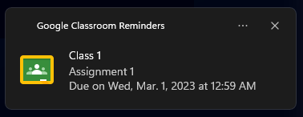

# Google Classroom Reminders App

Desktop application, made using NodeJS and ElectronJS. The purpose of the application is to create an easy interface for creating reminders for school assignments in Google Classroom.

Video of it working:

Here's a screenshot of what the reminder message looks like:

